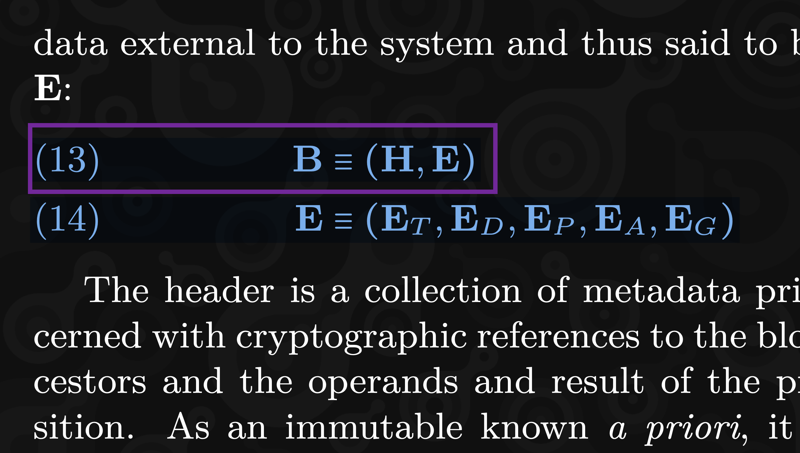

## What is this talk NOT About?

* What is JAM 🚫 
* Why JAM is useful 🚫
* How JAM is different from Polkadot 🚫

---

## What is this talk About?

* Hands-on approach ✅
* Read (and understand) math formulas ✅
* Implement JAM in actual code ✅

---

## JAM Crypto Innovations


---

## JAM Crypto Innovations

<!--  .slide: data-visibility="hidden" -->

 - Polkadot Virtual Machine (PVM) - RISC-V
 - Erasure Coding DA
 - VRF Ring Signatures / Bandersnatch
 - In-core + on-chain 
 - Parallel Execution
     - Each Core runs different computing jobs
     - State components updated in parallel
 - Safrole and Grandpa - less forks

---

# Formal Specification

---

## PVM 


---

## Erasure Coding


---

## Bandersnatch


---

## Block Structure


```rust
struct Block {
    header: Header,
    extrinsic: Extrinsic,
}
```

---

## Extrinsic Structure



```rust
struct Extrinsic {
    tickets: Vec<Ticket>,
    disputes: Disputes,
    preimages: Vec<Preimage>,
    assurances: Vec<Assurance>,
    guarantees: Vec<Guarantee>,
}
```

---

## State Structure


```rust
struct State {
    authorizer_pool: Vec<Vec<Hash>>,         // α
    recent_history: RecentHistory,           // β
    safrole: Safrole,                        // γ
    services: HashMap<u64, ServiceAccount>,  // δ
    entropy_pool: EntropyPool,               // η
    ...
}
```
---


## State Transition Function


```rust
let new_state = state_transition(state, block) 

fn state_transition(state: &State, block: Block) -> State {
  // Logic to update state with new block
}
```

---

## State Dependencies


```rust
let timeslot_ = get_timeslot(h);
let history_daga = get_history_data(h, &state.recent_history);
let history_ = get_history_(h, &ext.tickets, &history_daga, c);
```

---

## Data Encoding


```Elixir!
  def e(nil), do: <<>>    
  
  def e(x) when is_binary(x), do: x
  
  def e(%VariableSize{} = x), do: e(x.size) <> e(x.value)
```

---

## Block Encoding


---

## Block Encoding


```Elixir
  def e(%Block{extrinsic: e, header: h}), do: e({h, e})

  def e(%Block.Extrinsic{} = ex), 
    do: e({vs(ex.tickets), ex.disputes, vs(ex.preimages), 
     vs(ex.assurances), vs(ex.guarantees)
    })
```

---

## PVM


```Elixir
  @spec f(
    n_integer(), n_integer(), list(n_integer()), Memory.t()
    ) :: {n_integer(), list(integer()), Memory.t()}
  def f(n, gas, registers, memory) do
    if n == @gas do
      Host.remaining_gas(gas, registers, memory)
    else
      {gas - 10, 
       Enum.take(registers, 7) ++ 
       [@what | Enum.drop(registers, 8)], 
       memory}
    end
  end
```

---

## State Merklization


```Elixir!
def merkelize_state(t) do
  merkelize(
   for {k, v} <- t, do: {bits(k), {k, v}} |> Enum.into(%{})
  )
end
```

---

## Conclusion

- Start coding to understand JAM from a developer's perspective
- Elixir functional features reduces learning curve
- Faster development
- Functional alignment with math
- Reduced complexity

---

## Jamixir


Join us


